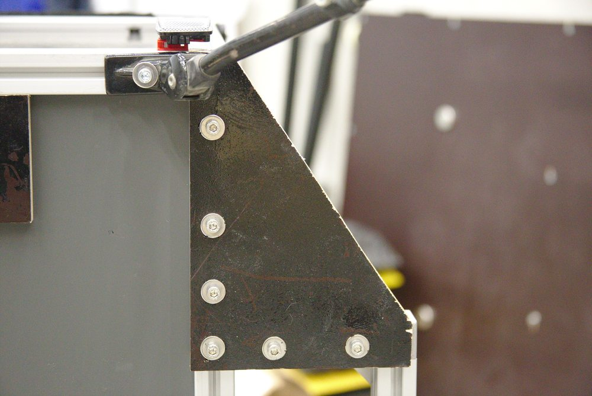
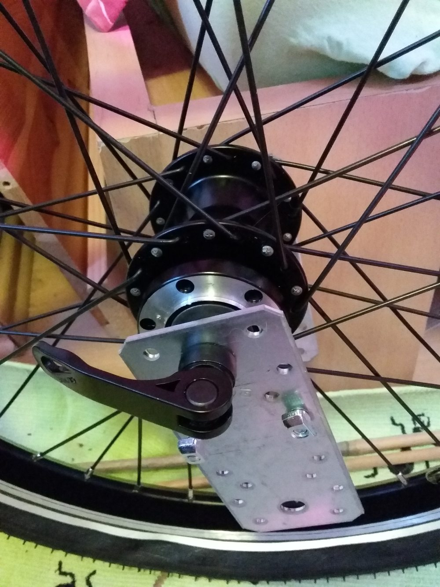

# DIY Fahrradanhänger

Anleitung für einen stabilen und einfach zu fertigenden Fahrradanhänger mit 1000x600mm Grundfläche, 400mm Kastenhöhe und 20" Laufrädern. Die Maße lassen sich durch Anpassung der Aluprofile und Platten natürlich ganz einfach ändern.
Die Breite der Grundfläche wurde so gewählt, dass genormte Eurokisten mit 600x400mm genau rein passen.

## Teile

### Aluminium Rahmen

Bei allen Profilen handelt es sich um 30x30 B-Typ Nut 8 Aluprofilen in verschiedenen Längen. Alle Teile sind bei [Dold Mechatronik](https://www.dold-mechatronik.de) verfügbar. Andere Anbieter sind aber kompatibel und unter Umständen günstiger. Wichtig ist, dass es sich um den B-Typ mit Nut 8 und nicht um den I-Typ handelt.

Für den Rahmen werden folgende Teile benötigt

### Profile

[Aluminiumprofil 30x30L B-Typ Nut 8](https://www.dold-mechatronik.de/Aluminiumprofil-30x30L-B-Typ-Nut-8-leicht-ZUSCHNITT-bis-1200mm-670-EUR-m-025-EUR-pro-Schnitt)

| Anz| Länge  | Preis  |
|----|-------:|-------:|
| 4x | 1000mm | 27,80€ |
| 6x |  600mm | 25,62€ |
| 4x |  400mm | 11,72€ |
| 4x |  106mm |  3,84€ |
|    | Gesamt | 68,98€ |

### Verbinder, Schrauben usw.

Schrauben und Hammermuttern werden im 100er Pack genommen um den Mengenrabatt zu nutzen.

| Anz | Typ    | Preis  |
|-----|--------|-------:|
| 8x | [3D Würfelverbinder Set](https://www.dold-mechatronik.de/Wuerfelverbinder-3D-30-B-Typ-Nut-8-mit-Befestigungssatz-3-x-M8x25) | 29,68€
| 4x | [2D Würfelverbinder Set](https://www.dold-mechatronik.de/Wuerfelverbinder-2D-30-B-Typ-Nut-8-mit-Befestigungssatz-2-x-M8x25) | 14,84€
| 4x | [Winkel 30x60 B-Typ Nut 8](https://www.dold-mechatronik.de/Winkel-30x60-B-Typ-Nut-8) |  9,56€
| 2x | [Knotenplatte I-Typ und B-Typ Nut 8](https://www.dold-mechatronik.de/Knotenplatte-I-Typ-und-B-Typ-Nut-8) |  5,40€
| 8x | [Verbinderplatte 58x58mm 3-Loch Alu gelasert](https://www.dold-mechatronik.de/Verbinderplatte-58x58mm-3-Loch-Alu-gelasert) |  6,96€
| 100x | [DIN 7380 Flachrundschraube mit Innensechskant, Edelstahl A2, M6X12](https://www.dold-mechatronik.de/DIN-7380-Flachrundschraube-mit-Innensechskant-Edelstahl-A2-M6X12) |  6,99€
| 100x | [Hammermutter B-Typ Nut 8, Gewindedurchmesser M6](https://www.dold-mechatronik.de/Hammermutter-B-Typ-Nut-8-Gewindedurchmesser-M6) | 15,00€
| x | Optional: [Abdeck- und Einfassprofil schwarz B-Typ Nut 8](https://www.dold-mechatronik.de/Abdeck-und-Einfassprofil-schwarz-B-Typ-Nut-8-Laenge-waehlbar) für Seitenwände | xx,xx€
|    | Gesamt | 88,43€ |

### Baumarktkomponenten

| Anz| Typ    | Preis  |
|----|--------|-------:|
| 2x | [Flachverbinder 135 x 55 mm, sendzimirverzinkt](https://www.hornbach.de/shop/Flachverbinder-135-x-55-mm-sendzimirverzinkt-1-Stueck/796496/artikel.html) (Achsaufnahmen, das große Loch muss 10-11mm Durchmesser haben!) |  2,10€ |
| 2x | [Sperrholz Pappel beidseitig Film/Film 4mm, Zuschnitt: 1014x414mm](https://www.hornbach.de/shop/Sperrholz-Pappel-beidseitig-Film-Film-1250x2500x4-mm-Zuschnitt-online-reservierbar/5194437/artikel.html) (Seitenwände) |  11,01€ |
| 2x | [Sperrholz Pappel beidseitig Film/Film 4mm, Zuschnitt: 614x414mm](https://www.hornbach.de/shop/Sperrholz-Pappel-beidseitig-Film-Film-1250x2500x4-mm-Zuschnitt-online-reservierbar/5194437/artikel.html)  (Seitenwände) |   6,66€ |
| 1x | [Kompaktplatte anthrazit 6mm, Zuschnitt: 1014x614mm (Bodenplatte)](https://www.hornbach.de/shop/Kompaktplatte-anthrazit-2800x1300x6-mm-Zuschnitt-online-reservierbar/10390383/artikel.html) | 23,99€ |
| 3x | [Rohrschelle 28 mm für 3/4 Zoll, Galv. gelb verzinkt](https://www.hornbach.de/shop/Rohrschelle-28-mm-fuer-3-4-Zoll-Galv-gelb-verzinkt/3375573/artikel.html) (evtl. noch mal Deichseldurchmesser messen und vergleichen) | 3,39€ |
| 3x | [Siebdrucksperrholz Birke Sieb/Film 1250x2500x12 mm ZUSCHNITT](https://www.hornbach.de/shop/Siebdrucksperrholz-Birke-Sieb-Film-1250x2500x15-mm-Zuschnitt-online-reservierbar/5017761/artikel.html) (Dreieckseinsätze, Deichselbefestigung Abstandsplatte) | ~10€ |
| 8x | Senkkopfschrauben M5/M6 (Deichselbefestigung) | ~10€ |
|    | Gesamt | 67,15€

### Fahrradteile

 Anz| Typ    | Preis  |
|----|--------|-------:|
| 1x | [Laufrad 20 Zoll Vorderrad Fahrrad Shimano DH-C3000 Dynamo Hohlkammer schwarz](https://www.ebay.de/itm/Laufrad-20-Zoll-Vorderrad-Fahrrad-Shimano-DH-C3000-Dynamo-Hohlkammer-schwarz/401905324327?ssPageName=STRK%3AMEBIDX%3AIT&_trksid=p2057872.m2749.l2649) | 65,40€ |
| 1x | [Laufrad 20 Zoll Vorderrad Fahrrad Faltrad Hohlkammer vorn 6 Loch Disc schwarz](https://www.ebay.de/itm/Laufrad-20-Zoll-Vorderrad-Fahrrad-Faltrad-Hohlkammer-vorn-6-Loch-Disc-schwarz/131660820938?ssPageName=STRK%3AMEBIDX%3AIT&_trksid=p2057872.m2749.l2649) | 33,20€ |
| 2x | 20" Fahrradschlauch | ~7€ |
| 2x | 20" Mantel | ~20€ |
| 1x | [Croozer Deichsel Click & Crooz](https://fahrradanhaenger-freiburg.de/deichseln/259-croozer-deichsel-click-crooz-4044494145607.html#/86-kupplung-eine_kupplung_hinzufugen) | 59,90€ |
| 2x | [AXA BLUELINE 50mm Standlicht LED Rückleuchte](https://www.ebay.de/itm/AXA-BLUELINE-50mm-Standlicht-LED-R%C3%BCckleuchte-Fahrrad-R%C3%BCcklicht-f%C3%BCr-Nabendynamo/173951611273?ssPageName=STRK%3AMEBIDX%3AIT&_trksid=p2057872.m2749.l2649) | 12,78€ |
| 2x | Frontreflektor | 2€ |
| 2x | Rückreflektor Klasse Z | 5€ |
|    | Gesamt | 205,28€

---
**Gesamtkosten ca. 430€**

### 3D Druckteile

Ein paar kleinere 3D Druckteile erleichtern die Befestigung von Lampen, Reflektoren und der Deichsel und sind auf [Thingiverse](https://www.thingiverse.com/thing:4752340) hochgeladen.

## Zusammenbau

Für den Zusammenbau braucht man eigentlich nur ein Set Sechskantschlüssel, Schraubenschlüssel, einen Akkuschrauber, für die Achsaufnahme evtl. noch eine Metallsäge sowie eine Holzsäge für die 12mm Siebdruckplatte.

> Da der Aufbau anfangs noch nicht 100%ig klar war, habe ich zwischendrin noch ein paar Änderungen vornehmen müssen, wodurch die Bilder vom Zwischenstand leider nicht immer mit dem Resultat übereinstimmen. Der Aufbau des Grundrahmens ist jedoch sehr einfach gehalten und lässt sich anhand der Bilder inkl. Detailaufnahmen recht gut nachvollziehen.

### Rahmen

Für den Rahmen benötigt man vier 3D Würfelverbinder inkl. passender M8 Senkkopfschrauben. Die M8 Schrauben können üblicherweise direkt in die Stirnseite der Aluprofile geschraubt werden. Ich hatte allerdings bei verschiedenen Chargen schon leichte Toleranzen, sodass ich die Stirnseite noch mal leicht aufbohren musste. Wenn man einen M8 Gewindeschneider zu Hause hat, kann man damit auch direkt Gewinde vorschneiden. Evtl. sollte man dann aber auch Schraubensicherung (zB Locktite) verwenden, sodass sich der Rahmen nicht durch Erschütterungen lösen kann.

Am besten fängt man mit dem Bodenrahmen an, verbindet drei Profile (1x600mm und 2x1000mm) zu einem U, schiebt die Bodenplatte inkl. Abstandshalter rein und verschließt das Ganze mit einem 600mm Profil. Dabei sollte man darauf achten, dass die "Nasen" der 3D Verbinder alle in eine Richtung (nach oben) zeigen, da dort die Profile für den Kastenaufbau befestigt werden.
Die Nut der 30er B-Typ Profile beträgt 8mm und die Dicke der Bodenplatte nur 6mm. Daher habe ich Abstandshalter konstruiert, die man direkt in die Nut schieben kann und per 3D Drucker hergestellt.

Man kann das aber sicherlich auch mit Dichtgummis aus dem Baumarkt oder vielleicht sogar Silikon lösen. Die Platte sollte aber einigermaßen fest sitzen, da sie sonst sehr laut klappert.

Als nächstes kann man den Rahmen für die Radaufnahme an die Seiten bauen. Dafür benötigt man die 2x600mm und 4x106mm Profile sowie die 2D Würfelverbinder, die Knotenplatten, 4x Verbinderplatte 58x58 und die 30x60mm Winkelverbinder. Die 106mm entsprechend der üblichen 100mm Achsbreite von Vorderrädern plus jeweils 3mm für die Achsaufnahmen.

Zuerst verbindet man das 600mm Profil und die 106mm Profile mittels 2D Würfelverbinder zu einem U. An den Enden der 106mm Profile bringt man dann jeweils außen die 30x60mm Winkelverbinder an, setzt das Konstrukt dann an den Rahmen an. Ich habe die Räder mittig positioniert, sodass das Gewicht letztendlich vor allem auf der Achse des Anhängers und nicht auf der Deichsel liegt. Eventuell ist es aber für die Fahreigenschaften von Vorteil, wenn die Räder leicht nach hinten versetzt sind.
Die Winkel- und Würfelverbinder wurden dann noch mit den Knotenblechen und Verbinderplatten versteift.

Damit man mit der entstandenen Ecke nicht an Poller hängen bleibt, befindet sich auf der Vorderseite des Anhängers ein 12mm dicker Dreieckseinsatz aus einer zurecht gesägten Siebdruckplatte.

Der Kastenaufbau ist optional. Dazu werden einfach die 400mm Streben hochkant auf die 3D Würfelverbinder gerschraubt. Danach die 4mm Sperrholzplatten einsetzen und oben die restlichen Profile drauf setzen. Die Seitenwände sind aus gewichtsgründen so dünn gewählt. Auch hier werden wieder Abstandshalter benötigt, damit die Wände nicht so sehr scheppern. Dafür habe ich wieder ein einfaches CAD Modell erstellt und mehrere Teile aus TPU (gummiartiges Material) ausgedruckt. Diese Teile lassen sich mit etwas Kraftaufwand zwischen Wand und Nut rein schieben.

Eine mögliche Alternative sind [Abdeck- und Einfassprofile](https://www.dold-mechatronik.de/Abdeck-und-Einfassprofil-schwarz-B-Typ-Nut-8-Laenge-waehlbar), die ich leider erst nach Fertigstellung im Dold Webshop entdeckt habe. Laut Beschreibung lassen sich Flächen von 2-4mm Dicke in die Einlassprofile schieben.

### Achsaufnahme

Als sehr günstige Achsaufnahme haben sich die Flachverbinder aus dem Baumarkt herausgestellt. Die genauen Maße sind relativ egal. Wichtig ist, dass die größere Bohrung 10-11mm Durchmesser hat, sodass die Achsen aufgenommen werden kann. Die kleinen Bohrungen sollten groß genug für M6 Schrauben sein. Im Zweifelsfall einfach Akkuschrauber mit passendem Bohrer bereit halten ;)

Die Verbinder einfach in der Mitte zersägen und noch eine Nut bis zur zur Achsbohrung aussägen und alle Kanten abfeilen/entgraten. Mit Schnellspannern kann man das aussägen der Nut auch einfach weg lassen und die beiden Flachverbinder beim einsetzen des Laufrads einfach ein wenig auseinander biegen. Ohne Schnellspanner funktioniert das leider nicht, da die Achsen inkl. Gewinde sonst zu lang sind.

Zum Schluss die Flachverbinder mit jeweils zwei Hammermuttern mittig an die Profile anschrauben und die Laufräder einsetzen.

### Deichselaufnahme

Je nachdem welche Deichsel verbaut werden soll, gestaltet sich die Anbringung unterschiedlich. Wir haben uns für eine [Croozer Deichsel inkl. Kupplung](https://fahrradanhaenger-freiburg.de/deichseln/259-croozer-deichsel-click-crooz-4044494145607.html#/86-kupplung-eine_kupplung_hinzufugen) entschieden, da bereits ein Anhänger der Marke vorhanden war und das Fahrrad eine entsprechende Kupplung besitzt.
Da die Deichsel aus einem runden Rohr besteht, konnte man sie im Gegensatz zu einer eckigen nicht direkt auf die Unterseite schrauben. Daher habe ich auch hier einen 3D Druck konstruiert, der für die grundlegende Fixierung sorgt.

Das Ganze wird mit ein paar Rohrschellen aus dem Baumarkt noch verstärkt, sodass die meiste Kraft auf die Metallteile gehen sollte. Ein Stück Siebdruckplatte überbrückt den Abstand zwischen Aluprofil und Bodenplatte, sodass die Deichsel hier aufliegt.

Ich habe hier mit Senkkopfschrauben gearbeitet, damit keine nervigen Schraubenköpfe am Anhängerboden überstehen und Kisten dann ggf. wackeln.

## Beleuchtung

Alle wichtigen Sachen zur notwendigen Beleuchtung stehen in [§ 67a Lichttechnische Einrichtungen an Fahrradanhängern StVZO](https://www.gesetze-im-internet.de/stvzo_2012/__67a.html). Bei einem Anhänger mit einer Breite zwischen 600mm und 1000mm sollte dher folgende Beleuchtung angebracht sein:

- Vorn: zwei paarweise angebaute weiße Rückstrahlern mit einem maximalen Abstand von 200 mm zur Außenkante
- Hinten: Schlussleuchte für rotes Licht auf der linken Seite sowie zwei rote Rückstrahler der Kategorie „Z“ mit einem maximalen Abstand von 200 mm zur Außenkante. Licht + Rückstrahler dürfen kombiniert sein (Absatz 5)
- Seiten: Fahrradmäntel mit ringförmigem Reflektorstreifen, relfektierende Speichenhülsen oder jeweils zwei Katzenaugen an den Laufrädern

Die Rücklichter habe ich direkt an die Profile der Achsaufnahmen befestigt, damit man den Kastenaufbau auch abnehmen kann und die Beleuchtung nicht umbauen muss. Dabei kam wieder ein 3D Druck zum Einsatz. Die LED Rücklichter sind oftmals so konzipiert, dass sie direkt an den Frontscheinwerfer angeschlossen werden müssen und sonst mit der Zeit durchbrennen. Daher empfiehlt es sich noch einen Überspannungsschutz zu installieren (z.B Shimano SM-DH10).

Zusätzlich befinden sich an der Rückwand zwei Reflektoren der Klasse Z, die noch in der Grabbelkiste lagen. Falls der Kastenaufbau sowieso drauf bleiben soll, kann man auch hier die Rücklichter anbringe. Die Schraubpunkte haben üblicherweise 50 oder 80mm Abstand.

## Weitere Bilder

Unterseite

Mit 50Kg Beladung

## Gewicht

- Gesamtgewicht (mit Kofferwaage gemessen) ~24Kg
- Kastenaufbau (rechnerisch)
  - Seitenwände ~3,64Kg Pappel 4mm
  - Aluprofile 4,032Kg
  - Verbinder 0,16Kg
  - Gesamt: 7,8Kg
